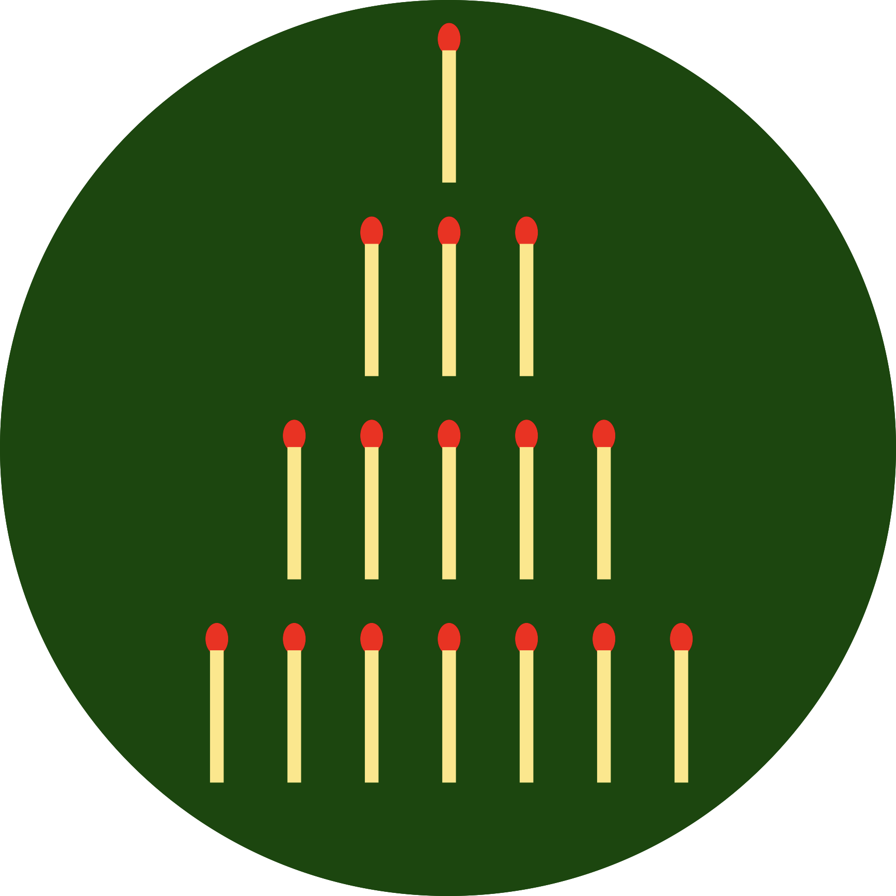
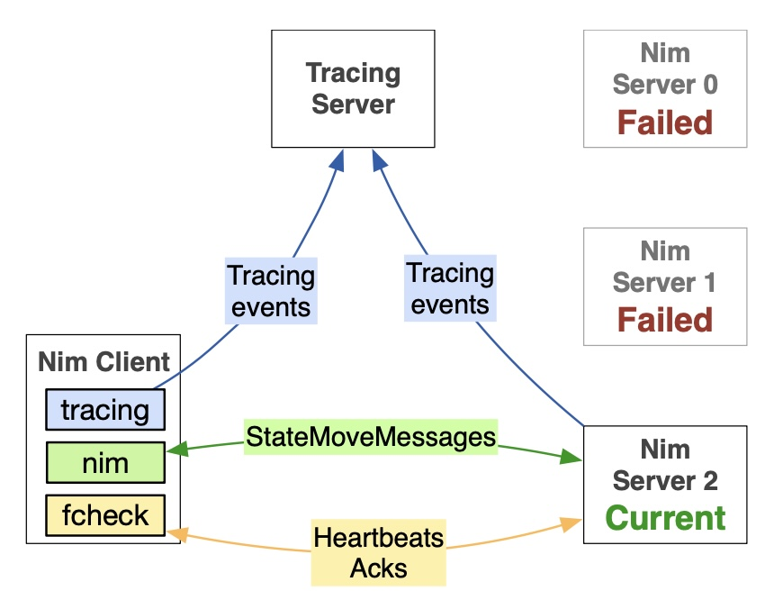

<!-- PROJECT LOGO -->
<br />
<p align="center">
 <a href="https://github.com/sassansh/Robust-Nim-Client">
    
  </a>
  <h2 align="center">Robust Nim Client</h2>

  <p align="center">
     Robust nim client with failure detection, failover support, and distributed tracing. Built as an assignment for UBC's <a href="https://courses.students.ubc.ca/cs/courseschedule?pname=subjarea&tname=subj-course&dept=CPSC&course=416">CPSC 416</a> (Distributed Systems).
  </p>
</p>

<p align="center">
    
</p>

## Table of Contents

- [Assignment Spec 🎯](#Assignment-spec-)
- [Technology Stack 🛠️](#technology-stack-%EF%B8%8F)
- [Prerequisites 🍪](#prerequisites-)
- [Setup 🔧](#setup-)

## Assignment Spec 🎯

For a PDF containing the assignment's specifications, please view [assignment-spec.pdf](https://github.com/sassansh/Robust-Nim-Client/blob/main/assignment-spec.pdf).

## Technology Stack 🛠️

[Go](https://go.dev)

## Prerequisites 🍪

You should have [GoLand](https://www.jetbrains.com/go/download/), [Go v1.18.1](https://go.dev/dl/) and [Git](https://git-scm.com/) installed on your PC.

## Setup 🔧

1. Clone the repo using:

   ```bash
     git clone https://github.com/sassansh/Robust-Nim-Client.git
   ```

2. Open the project in GoLand.

3. To start the client, run:

   ```bash
     go run cmd/client/main.go
   ```

   Note: Client needs to be configured to connect to a nim server. The server code was not provided to us.
